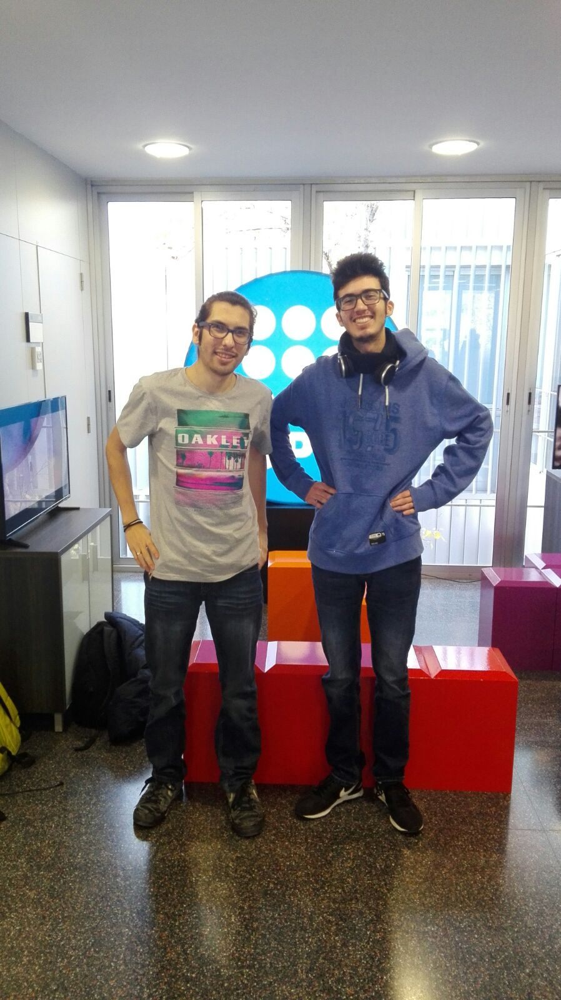

## Presentation

Mega Man Requiem is a basic Mega Man platformer tribute of the classic Mega Man games from the NES, using 
the sprites from the playable character and levels of Mega Man (1987).

This tribute has been made by David Varela and David Valdivia, two students from the UPC videogames degree.

## Team

_David Valdivia_
* **Github**: [AwesomeSuitGuy](https://github.com/AwesomeSuitGuy)
### Work Done:
   
   * Character Jump
   
   * 1st Map
  
   * Pathfinding system
   
   * UI system
   
   * Menus
   
_David Varela_
* **Github**: [lFreecss](https://github.com/lFreecss)
### Work Done:

   * Map logic and map colliders
   
   * 2nd map
   
   * Character double jump
   
   * FPS cap and dt normalizing 
   
   * Fade to black
   
   * Timer
   
   * Pause

## Main Core Subsystems

The game works with a module system. The main module is caled j1App. This module manages every other module. Each one of this modules 
composes one necessary part for the game to work, like the window system, the rendering system, audio, etc.

These modules have an awake, start, preupdate, update, postupdate and cleanup methods that are inherited by the j1Module base module.

Awake charges everything from an XML file and Start starts the module. This two modules are called only one time during the loop of the 
game. The update modules are called every iteration of the game, and the cleanup module is called when the game closes. The structure of 
the game counts with an entity system for the game objects and another one for the UI.

The game is made with the extern C++ libraries SDL and PUGI XML.

### Innovation

We made a pause button for the third assignment.

## Installation

Link to the code repository of the game.

[Code Repository](https://github.com/lFreecss/Mega-Man-Requiem)

Unzip the release folder and execute the .exe file to play.

[Release](https://github.com/lFreecss/Mega-Man-Requiem/releases/tag/1.0)

## Gameplay

<iframe width="560" height="315" src="https://www.youtube.com/embed/ICWjs-c_sjg" frameborder="0" allowfullscreen></iframe>

## Game Controls

   Moves:
    
       * ↑ ➲ Move player up (Player has double jump)
     
       * ← ➲ Move player left
    
       * → ➲ Move player right
   
   Pause:
   
      * P ➲ Pause Game
   
   Debug Keys:
   
      * F1 ➲ Start from the very first level
   
      * F2 ➲ Start from the beginning of the current level
   
      * F5 ➲ Save the current state
   
      * F6 ➲ Load the previous state (even across levels)
   
      * F8 ➲ Debug UI
   
      * F9 ➲ To view colliders
   
      * F10 ➲ God Mode
   
      * F11 ➲ Enable/Disable FPS cap to 30   

## Sources

[Player](http://www.sprites-inc.co.uk/sprite.php?local=/Classic/Megaman/MM8/)

[Enemies](http://www.sprites-inc.co.uk/sprite.php?local=Classic/MM1/Enemy/)
[Enemies](http://www.sprites-inc.co.uk/sprite.php?local=Classic/MM2/Enemy/)
[Enemies](http://www.sprites-inc.co.uk/sprite.php?local=Classic/MM3/Enemy/)

[UISprites](http://www.sprites-inc.co.uk/sprite.php?local=Classic/MM2/Misc/)
[UISprites](http://www.sprites-inc.co.uk/sprite.php?local=Classic/MM5/Misc/)
[UISprites](https://www.spriters-resource.com/nes/mm/sheet/45633/)

[Tilesets](http://www.sprites-inc.co.uk/sprite.php?local=Classic/MM1/Tiles/)

[Music](https://downloads.khinsider.com/game-soundtracks/album/mega-man-nes)
[Music](https://downloads.khinsider.com/game-soundtracks/album/megaman-2-original-soundtrack)

[SoundEffects](https://www.sounds-resource.com/nes/megaman/)
     
## License

MIT License

Copyright (c) 2017 David Varela Hernandez, David Valdivia Martínez

Permission is hereby granted, free of charge, to any person obtaining a copy
of this software and associated documentation files (the "Software"), to deal
in the Software without restriction, including without limitation the rights
to use, copy, modify, merge, publish, distribute, sublicense, and/or sell
copies of the Software, and to permit persons to whom the Software is
furnished to do so, subject to the following conditions:

The above copyright notice and this permission notice shall be included in all
copies or substantial portions of the Software.

THE SOFTWARE IS PROVIDED "AS IS", WITHOUT WARRANTY OF ANY KIND, EXPRESS OR
IMPLIED, INCLUDING BUT NOT LIMITED TO THE WARRANTIES OF MERCHANTABILITY,
FITNESS FOR A PARTICULAR PURPOSE AND NONINFRINGEMENT. IN NO EVENT SHALL THE
AUTHORS OR COPYRIGHT HOLDERS BE LIABLE FOR ANY CLAIM, DAMAGES OR OTHER
LIABILITY, WHETHER IN AN ACTION OF CONTRACT, TORT OR OTHERWISE, ARISING FROM,
OUT OF OR IN CONNECTION WITH THE SOFTWARE OR THE USE OR OTHER DEALINGS IN THE
SOFTWARE.
     
     
    
CITM Terrassa 2016-2017
